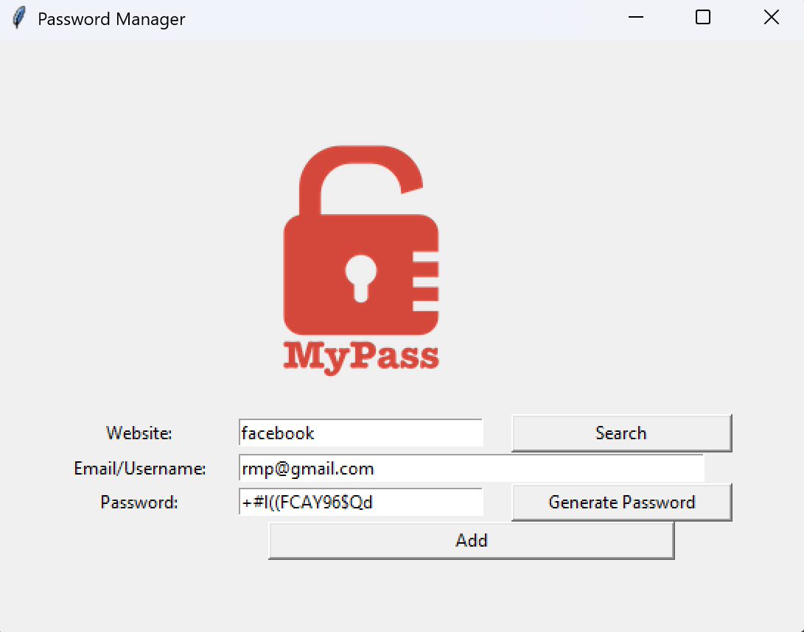
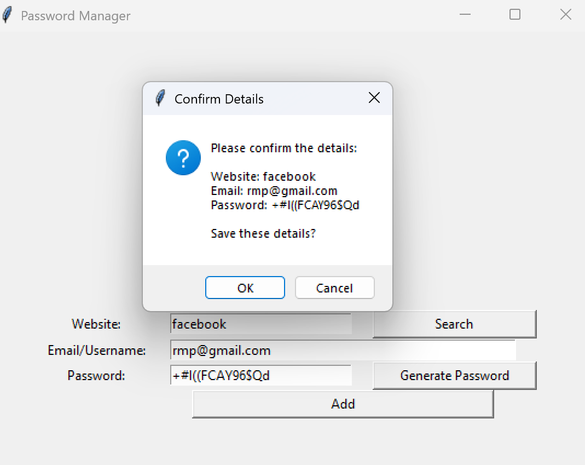

# Password Manager Python

A Python-based password manager with a simple GUI built using Tkinter. It allows you to generate strong random passwords, save login credentials securely in a local JSON file, and retrieve them when needed.


## Features

✅ Generate secure, random passwords
✅ Save and retrieve login credentials for websites
✅ Email validation using regex
✅ Search functionality for stored entries
✅ Data saved locally in a structured JSON file
✅ Clean and intuitive graphical user interface (GUI)


## Tech Stack

- Python 3.x
- Tkinter (GUI)
- JSON (data storage)
- Regex (email validation)


## Screenshots





## How to Run

1. **Clone the repository:**
   ```bash
   git clone https://github.com/your-username/Password-Manager-Python.git
   cd Password-Manager-Python
